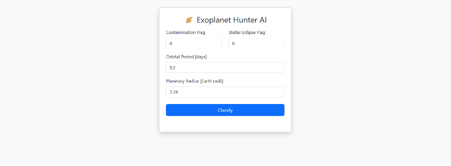

## Exoplanet Hunter AI 🪐

## Table of Contents

 - \[Project Overview](#project-overview)

 - \[Demo](#demo)

 - \[Features](#features)

 - \[Tech Stack](#tech-stack)

 - \[Setup and Installation](#setup-and-installation)

 - \[Usage](#usage)

 - \[Future Improvements](#future-improvements)

## Project Overview

This project is a full-stack web application that uses a machine learning model to classify celestial objects from NASA's Kepler mission. It can predict whether an object is a \*\*Confirmed Exoplanet\*\*, a \*\*Planetary Candidate\*\*, or a \*\*False Positive\*\* based on transit photometry data. The project includes a data analysis notebook, a trained classification model, a Flask REST API, and an interactive web interface.

## Demo 🎥

## Features

 - *\*Exoplanet Classification:\*\* Core feature - classifies data points using a trained Machine Learning model (Random Forest/XGBoost).

 - *\*Web Interface:\*\* A clean, modern user interface for submitting data and viewing live predictions.

 - *\*REST API:\*\* A backend Flask API that serves the model's predictions.

 - *\*Professional Structure:\*\* Organized into a standard project structure with separation of concerns.

## Tech Stack

 - *\*Backend:\*\* Python, Flask, Scikit-learn, Pandas, NumPy, XGBoost

 - *\*Frontend:\*\* HTML, CSS, JavaScript, Bootstrap 5

 - *\*Development:\*\* Jupyter Lab, Git \& GitHub

 - *\*Data Source:\*\* NASA Exoplanet Archive (Kepler Objects of Interest)

## Project Structure

exoplanet-hunter/
├── ml_models/               # Stores the serialized ML model and preprocessing objects
├── notebooks/               # Contains the Jupyter Notebook for EDA and model experimentation
├── static/                  # Frontend assets (CSS, JavaScript)
│   ├── css/
│   │   └── style.css
│   └── js/
│       └── main.js
├── templates/               # HTML templates for the Flask application
│   └── index.html
├── .gitignore               # Specifies which files and folders for Git to ignore
├── app.py                   # The main Flask application script (backend)
├── README.md                # Project documentation (this file)
└── requirements.txt         # List of Python package dependencies

## Setup and Installation

Follow these steps to run the project on your local machine.

1\. *\*Clone the repository:\*\*

 -git clone https://github.com/MoahamedMamdouh/exoplanet-hunter.git

 -cd exoplanet-hunter

2\. *\*Create and activate a virtual environment:\*\*

 -python -m venv venv

 -.\\venv\\Scripts\\activate

3\. *\*Install dependencies:\*\*

 -pip install -r requirements.txt

4\. *\*Run the application:\*\*

 -python app.py

5\. *\*Access the application:\*\*

 -Open your web browser and navigate to `http://127.0.0.1:5000/`.

## Usage

1\. Navigate to the homepage.

2\. The page presents a form with four key input fields related to the celestial object.

3\. Enter the values for the object you want to classify.

4\. Click the "Classify" button.

5\. The model's prediction will appear below the button, highlighted in green for 'CONFIRMED', orange for 'CANDIDATE', or red for 'FALSE POSITIVE'.

\## Future Improvements

\- \[ ] Implement a more robust data validation system for user inputs.

\- \[ ] Containerize the application with Docker for easier deployment.

\- \[ ] Add a page to display model performance metrics (e.g., confusion matrix).

